# AI Customer Support Platform

Sistema multicanal de atención al cliente con IA, RAG conversacional, análisis de sentimientos y handoff a agentes humanos.

---

## Tabla de Contenidos

- [Visión General](#visión-general)
- [Arquitectura del Sistema](#arquitectura-del-sistema)
- [Flujo de Conversación](#flujo-de-conversación)
- [Integración con Chatwoot](#integración-con-chatwoot)
- [Canales de Comunicación](#canales-de-comunicación)
- [Sistema RAG](#sistema-rag)
- [Análisis de Sentimientos](#análisis-de-sentimientos)
- [Clasificación de Conversaciones](#clasificación-de-conversaciones)
- [Handoff a Agentes Humanos](#handoff-a-agentes-humanos)
- [Estructura del Proyecto](#estructura-del-proyecto)
- [Configuración e Instalación](#configuración-e-instalación)
- [API Endpoints](#api-endpoints)

---

## Visión General

### ¿Qué hace esta plataforma?

```mermaid
graph LR
    subgraph Clientes
        A[📱 WhatsApp]
        B[💬 Web Chat]
        C[📧 Email]
        D[📞 Voz]
    end

    subgraph "Plataforma IA"
        E[🤖 Bot IA]
        F[🧠 RAG]
        G[📊 Análisis]
    end

    subgraph Agentes
        H[👤 Agente 1]
        I[👤 Agente 2]
        J[👔 Supervisor]
    end

    A --> E
    B --> E
    C --> E
    D --> E
    E <--> F
    E <--> G
    E -.->|Handoff| H
    E -.->|Handoff| I
    J -->|Monitorea| E
```

### Capacidades Principales

| Función | Descripción |
|---------|-------------|
| 🤖 **Bot IA Multicanal** | Responde automáticamente en WhatsApp, Web, Email y Voz |
| 🧠 **RAG Inteligente** | Busca respuestas en la base de conocimiento del cliente |
| 📊 **Análisis de Sentimiento** | Detecta frustración y emociones en tiempo real |
| 🏷️ **Clasificación Automática** | Categoriza conversaciones por tema e intención |
| 👥 **Handoff Inteligente** | Transfiere a humanos cuando es necesario |
| 📈 **Dashboard en Tiempo Real** | Supervisores ven todas las conversaciones live |
| 🏢 **Multi-tenant** | Múltiples empresas en una sola plataforma |

---

## Arquitectura del Sistema

### Vista de Alto Nivel

```mermaid
graph TB
    subgraph "Canales de Entrada"
        WA[📱 WhatsApp<br/>Twilio]
        WC[💬 Web Chat<br/>Chatwoot Widget]
        EM[📧 Email<br/>SMTP/IMAP]
        VO[📞 Voz<br/>Twilio/Retell]
    end

    subgraph "Gateway Layer"
        GW[🔌 API Gateway<br/>FastAPI]
        AUTH[🔐 Autenticación<br/>& Rate Limiting]
        ROUTE[🔀 Router<br/>Multi-tenant]
    end

    subgraph "Processing Layer"
        CE[🧠 Conversation<br/>Engine]
        SA[📊 Sentiment<br/>Analyzer]
        IC[🏷️ Intent<br/>Classifier]
        HE[⚠️ Handoff<br/>Evaluator]
    end

    subgraph "AI Layer"
        RAG[📚 RAG Pipeline]
        VDB[(🗄️ Qdrant<br/>Vector DB)]
        LLM[🤖 LiteLLM<br/>GPT/Gemini/Claude]
    end

    subgraph "Control Center - Chatwoot"
        CW[💼 Dashboard<br/>Agentes]
        RT[📡 Real-time<br/>Updates]
        AN[📈 Analytics<br/>& Reports]
    end

    subgraph "Data Layer"
        FS[(🔥 Firestore<br/>Sessions)]
        PG[(🐘 PostgreSQL<br/>Chatwoot)]
    end

    WA --> GW
    WC --> GW
    EM --> GW
    VO --> GW

    GW --> AUTH
    AUTH --> ROUTE
    ROUTE --> CE

    CE --> SA
    CE --> IC
    CE --> HE
    CE <--> RAG

    RAG <--> VDB
    RAG <--> LLM

    CE <--> CW
    CW --> RT
    CW --> AN

    CE --> FS
    CW --> PG
```

### Flujo de Datos Simplificado

```mermaid
flowchart LR
    subgraph Input
        MSG[📩 Mensaje<br/>Entrante]
    end

    subgraph Processing
        direction TB
        P1[1️⃣ Analizar<br/>Sentimiento]
        P2[2️⃣ Clasificar<br/>Intent]
        P3[3️⃣ Evaluar<br/>Handoff]
        P4[4️⃣ Buscar en<br/>Knowledge Base]
        P5[5️⃣ Generar<br/>Respuesta]
    end

    subgraph Output
        BOT[🤖 Respuesta<br/>Automática]
        HUMAN[👤 Transferir<br/>a Humano]
    end

    MSG --> P1 --> P2 --> P3
    P3 -->|No handoff| P4 --> P5 --> BOT
    P3 -->|Handoff| HUMAN
```

---

## Flujo de Conversación

### Flujo Principal: Mensaje Entrante

```mermaid
sequenceDiagram
    autonumber
    participant U as 👤 Usuario
    participant T as 📱 Twilio
    participant API as 🔌 API Gateway
    participant CE as 🧠 Conv. Engine
    participant SA as 📊 Sentiment
    participant RAG as 📚 RAG
    participant LLM as 🤖 LLM
    participant CW as 💼 Chatwoot
    participant AG as 👨‍💼 Agente

    U->>T: "Hola, tengo un problema con mi pedido"
    T->>API: POST /webhooks/whatsapp/{tenant}
    API->>CE: Procesar mensaje

    par Análisis Paralelo
        CE->>SA: Analizar sentimiento
        SA-->>CE: score: -0.2 (neutral)
    and
        CE->>RAG: Buscar contexto relevante
        RAG-->>CE: [docs sobre pedidos]
    end

    CE->>CE: Evaluar handoff triggers
    Note over CE: ✅ Sentiment OK<br/>✅ No keywords de escalación<br/>✅ Fallbacks: 0

    CE->>LLM: Generar respuesta con contexto
    LLM-->>CE: "Lamento el inconveniente. ¿Podrías darme tu número de pedido?"

    CE->>CW: Guardar conversación
    CE->>T: Enviar respuesta
    T->>U: "Lamento el inconveniente..."

    Note over CW: Agente ve conversación<br/>en tiempo real 👀
    AG-->>CW: Monitorea (no interviene)
```

### Flujo de Escalación (Handoff)

```mermaid
sequenceDiagram
    autonumber
    participant U as 👤 Usuario
    participant CE as 🧠 Conv. Engine
    participant SA as 📊 Sentiment
    participant HE as ⚠️ Handoff Eval
    participant CW as 💼 Chatwoot
    participant AG as 👨‍💼 Agente

    U->>CE: "Esto es INACEPTABLE! Quiero hablar con alguien YA!"

    CE->>SA: Analizar sentimiento
    SA-->>CE: score: -0.8 (muy negativo) 🔴

    CE->>HE: Evaluar triggers
    Note over HE: ❌ Sentiment < -0.5<br/>❌ Keyword "hablar con alguien"<br/>➡️ HANDOFF REQUIRED

    HE-->>CE: HandoffDecision(trigger=NEGATIVE_SENTIMENT)

    CE->>CW: Crear ticket urgente 🚨
    Note over CW: 🔔 Notificación push<br/>al agente disponible

    CE->>U: "Entiendo tu frustración. Te conecto con un agente ahora mismo."

    CW->>AG: 🔔 Nueva conversación urgente
    AG->>CW: Acepta conversación
    CW->>CE: Agente tomó control

    Note over CE: 🤖 Bot PAUSADO<br/>👤 Agente en control

    AG->>U: "Hola, soy María. Veo que tienes un problema urgente..."

    Note over AG,U: Conversación humana directa

    AG->>CW: Marca como "Resuelto" ✅
    CW->>CE: Conversación cerrada
```

---

## Integración con Chatwoot

### ¿Qué es Chatwoot?

**Chatwoot** es una plataforma open-source de customer engagement que funciona como:

| Función | Descripción |
|---------|-------------|
| 📥 **Inbox Unificado** | Todos los canales en un solo lugar |
| 👀 **Vista en Tiempo Real** | Agentes ven conversaciones del bot live |
| 🎛️ **Panel de Control** | Interfaz para agentes humanos |
| 📊 **Analytics** | Reportes y métricas |
| 🔔 **Notificaciones** | Alertas para handoffs urgentes |

### Arquitectura de Integración Bot ↔ Chatwoot

```mermaid
graph TB
    subgraph "Fuentes de Mensajes"
        WA[📱 WhatsApp]
        WEB[💬 Web Widget]
        FB[📘 Facebook]
        TW[🐦 Twitter]
    end

    subgraph "Nuestro Backend"
        BOT[🤖 Bot IA<br/>FastAPI]
        PROC[⚙️ Message<br/>Processor]
    end

    subgraph "Chatwoot"
        INBOX[📥 Inbox<br/>Unificado]
        CONV[💬 Conversaciones]
        AGENTS[👥 Panel de<br/>Agentes]
        AUTO[⚡ Automation<br/>Rules]
        REPORTS[📊 Reportes]
    end

    subgraph "Equipo"
        A1[👤 Agente 1]
        A2[👤 Agente 2]
        SUP[👔 Supervisor]
    end

    WA -->|Webhook| BOT
    WEB -->|Widget API| INBOX
    FB --> INBOX
    TW --> INBOX

    BOT <-->|API Bidireccional| INBOX
    BOT --> PROC
    PROC --> CONV

    INBOX --> CONV
    CONV --> AGENTS
    CONV --> AUTO
    CONV --> REPORTS

    AGENTS --> A1
    AGENTS --> A2
    AGENTS --> SUP
```

### Flujo de Datos Detallado Bot ↔ Chatwoot

```mermaid
sequenceDiagram
    participant WA as 📱 WhatsApp
    participant BOT as 🤖 Bot IA
    participant CW_API as 🔌 Chatwoot API
    participant CW_UI as 💼 Chatwoot UI
    participant AGENT as 👤 Agente

    Note over BOT,CW_API: 1️⃣ SINCRONIZACIÓN DE MENSAJES

    WA->>BOT: Mensaje entrante
    BOT->>BOT: Procesa con IA
    BOT->>CW_API: POST /conversations/{id}/messages
    Note right of CW_API: Guarda mensaje del usuario<br/>+ respuesta del bot

    CW_API->>CW_UI: WebSocket update
    CW_UI->>AGENT: 🔔 Nueva actividad

    Note over BOT,CW_API: 2️⃣ HANDOFF A HUMANO

    BOT->>CW_API: POST /conversations/{id}/assignments
    Note right of CW_API: Asigna a agente o equipo
    CW_API->>CW_UI: Notificación de asignación
    AGENT->>CW_UI: Acepta conversación

    Note over BOT,CW_API: 3️⃣ AGENTE TOMA CONTROL

    CW_UI->>CW_API: Agente envía mensaje
    CW_API->>BOT: Webhook: agent_message
    BOT->>BOT: ⏸️ Pausa respuestas automáticas
    CW_API->>WA: Envía mensaje del agente

    Note over BOT,CW_API: 4️⃣ DEVOLUCIÓN AL BOT

    AGENT->>CW_UI: Marca "Resuelto" o "Devolver a bot"
    CW_UI->>CW_API: Update conversation status
    CW_API->>BOT: Webhook: conversation_resolved
    BOT->>BOT: ▶️ Reactiva respuestas automáticas
```

### Vista del Panel de Chatwoot

```
┌─────────────────────────────────────────────────────────────────────────┐
│  🏠 Chatwoot - Acme Corp                              🔔 3  👤 María    │
├─────────────────────────────────────────────────────────────────────────┤
│                                                                         │
│  ┌──────────────┐  ┌─────────────────────────────────────────────────┐ │
│  │ 📥 INBOX     │  │ Conversación #1234                    🤖→👤     │ │
│  │              │  │                                                  │ │
│  │ 📋 Todos (12)│  │ ┌─────────────────────────────────────────────┐ │ │
│  │ 🤖 Bot (8)   │  │ │ 👤 Cliente                           14:32 │ │ │
│  │ 👤 Míos (3)  │  │ │ Hola, necesito ayuda con mi pedido #5678   │ │ │
│  │ ⚠️ Urgente(1)│  │ └─────────────────────────────────────────────┘ │ │
│  │              │  │ ┌─────────────────────────────────────────────┐ │ │
│  │ ───────────  │  │ │ 🤖 Bot                               14:32 │ │ │
│  │              │  │ │ ¡Hola! Veo tu pedido #5678. ¿En qué puedo  │ │ │
│  │ 🏷️ ETIQUETAS │  │ │ ayudarte específicamente?                  │ │ │
│  │ 🔴 Frustrado │  │ └─────────────────────────────────────────────┘ │ │
│  │ 🟡 Consulta  │  │ ┌─────────────────────────────────────────────┐ │ │
│  │ 🟢 Resuelto  │  │ │ 👤 Cliente                           14:33 │ │ │
│  │ 🔵 Venta     │  │ │ No llegó! Ya pasaron 10 días y nada!!      │ │ │
│  │              │  │ └─────────────────────────────────────────────┘ │ │
│  │ ───────────  │  │                                                 │ │
│  │              │  │ ┌─────────────────────────────────────────────┐ │ │
│  │ 💬 RECIENTES │  │ │ ⚠️ SENTIMENT: Negativo (-0.7)              │ │ │
│  │              │  │ │ 🏷️ INTENT: Queja - Envío                   │ │ │
│  │ 🟡 Juan P.   │  │ └─────────────────────────────────────────────┘ │ │
│  │   Consulta.. │  │                                                 │ │
│  │ 🔴 María G.  │  │ ┌─────────────────────────────────────────────┐ │ │
│  │   URGENTE    │  │ │ [👤 Tomar control] [📋 Asignar] [✅ Cerrar] │ │ │
│  │ 🟢 Pedro S.  │  │ └─────────────────────────────────────────────┘ │ │
│  │   Resuelto   │  │                                                 │ │
│  └──────────────┘  │ ┌─────────────────────────────────────────────┐ │ │
│                    │ │ 💬 Escribir mensaje...              [Enviar]│ │ │
│                    │ └─────────────────────────────────────────────┘ │ │
│                    └─────────────────────────────────────────────────┘ │
│                                                                         │
│  ┌───────────────────────────────────────────────────────────────────┐ │
│  │ 📋 PANEL LATERAL - Detalles del Cliente                          │ │
│  │ ─────────────────────────────────                                 │ │
│  │ 👤 María González                                                 │ │
│  │ 📱 +54 9 261 346-7481                                             │ │
│  │ 📧 maria@email.com                                                │ │
│  │                                                                   │ │
│  │ 🏷️ Etiquetas: Cliente VIP, Compras frecuentes                    │ │
│  │ 📊 Sentiment promedio: 😐 Neutral                                 │ │
│  │ 💬 Conversaciones previas: 5                                      │ │
│  │ 🛒 Último pedido: #5678 - En tránsito                             │ │
│  └───────────────────────────────────────────────────────────────────┘ │
└─────────────────────────────────────────────────────────────────────────┘
```

---

## Canales de Comunicación

### WhatsApp (Twilio) - Implementado ✅

```mermaid
graph LR
    subgraph "Usuario"
        U[📱 WhatsApp App]
    end

    subgraph "Twilio"
        TW_IN[📥 Webhook<br/>Entrada]
        TW_OUT[📤 API<br/>Salida]
    end

    subgraph "Nuestro Sistema"
        WH[🔌 /webhooks/whatsapp/]
        PROC[⚙️ Procesador]
        RESP[💬 Generador<br/>Respuesta]
    end

    U -->|Envía mensaje| TW_IN
    TW_IN -->|POST| WH
    WH --> PROC
    PROC --> RESP
    RESP -->|API call| TW_OUT
    TW_OUT -->|Entrega| U
```

**Características:**
- ✅ Mensajes de texto
- ✅ Imágenes, audio, documentos
- ✅ Templates para mensajes fuera de ventana 24h
- ✅ Botones interactivos y listas
- ✅ Tracking de entrega y lectura

### Web Chat (Chatwoot Widget) - Pendiente

```mermaid
graph LR
    WEB[🌐 Sitio Web] -->|Embebido| WIDGET[💬 Chat Widget]
    WIDGET <-->|WebSocket| CW[💼 Chatwoot]
    CW <-->|API| BOT[🤖 Bot IA]
```

### Voz (Twilio Voice + Retell AI) - Futuro

```mermaid
graph TB
    subgraph "Llamada Entrante"
        PHONE[📞 Teléfono]
        TWILIO_V[📱 Twilio Voice]
    end

    subgraph "Procesamiento de Voz"
        STT[🎤 Speech-to-Text<br/>Deepgram]
        NLU[🧠 Procesamiento<br/>NLU]
        TTS[🔊 Text-to-Speech<br/>ElevenLabs]
    end

    subgraph "Bot IA"
        CE[🧠 Conversation<br/>Engine]
        RAG[📚 RAG]
        LLM[🤖 LLM]
    end

    PHONE -->|Llama| TWILIO_V
    TWILIO_V -->|Media Stream| STT
    STT -->|Texto| NLU
    NLU --> CE
    CE <--> RAG
    CE <--> LLM
    CE --> TTS
    TTS -->|Audio| TWILIO_V
    TWILIO_V -->|Respuesta| PHONE
```

**Flujo de llamada:**
1. Cliente llama al número
2. Twilio establece conexión WebSocket
3. Audio se transcribe en tiempo real (STT)
4. Texto se procesa igual que chat
5. Respuesta se convierte a voz (TTS)
6. Audio se envía al cliente

### Vista del Operario - Llamada en Curso

```
┌─────────────────────────────────────────────────────────────────────────────┐
│  🏢 EventNet Support - Llamada en Curso                                     │
├─────────────────────────────────────────────────────────────────────────────┤
│                                                                             │
│  ┌──────────────────────────────────────────────────────────────────────┐  │
│  │  📞 LLAMADA ACTIVA - Juan Pérez                         ⏱️ 02:34     │  │
│  │  ────────────────────────────────────────────────────────────────    │  │
│  │                                                                      │  │
│  │  🎙️ TRANSCRIPCIÓN EN VIVO:                                          │  │
│  │  ─────────────────────────────────────────────────────────────────   │  │
│  │  [00:00] 👤 "Hola, buenas tardes"                                    │  │
│  │  [00:02] 🤖 "Hola, bienvenido a EventNet, soy tu asistente..."      │  │
│  │  [00:08] 👤 "Sí, mira, compré entradas para Coldplay y no me..."    │  │
│  │  [00:15] 🤖 "Entiendo, déjame verificar tu compra. ¿Me podés..."    │  │
│  │  [00:22] 👤 "juan.perez@gmail.com"                                   │  │
│  │  [00:25] 🤖 "Perfecto, encontré tu orden. El email fue enviado..."  │  │
│  │  [00:35] 👤 "Ya revisé y no está! Esto es una vergüenza..."         │  │
│  │                                                                      │  │
│  │  ⚠️ SENTIMIENTO: Frustración detectada en tono de voz               │  │
│  │                                                                      │  │
│  │  ┌────────────────────────────────────────────────────────────┐     │  │
│  │  │  [🎧 TOMAR LLAMADA]  [📝 Notas]  [📧 Enviar email]         │     │  │
│  │  └────────────────────────────────────────────────────────────┘     │  │
│  │                                                                      │  │
│  └──────────────────────────────────────────────────────────────────────┘  │
│                                                                             │
│  ┌──────────────────────────────────────────────────────────────────────┐  │
│  │  📊 ANÁLISIS DE VOZ                                                  │  │
│  │  • Tono: Elevado (frustración)                                       │  │
│  │  • Velocidad: Rápida (ansiedad)                                      │  │
│  │  • Palabras clave: "vergüenza", "no está", "pagué"                  │  │
│  └──────────────────────────────────────────────────────────────────────┘  │
│                                                                             │
└─────────────────────────────────────────────────────────────────────────────┘
```

**Lo que ve el operario en tiempo real:**

| Elemento | Descripción |
|----------|-------------|
| 📞 **Estado de llamada** | Duración, nombre del cliente, número |
| 🎙️ **Transcripción live** | Texto en tiempo real de lo que dice cliente y bot |
| ⚠️ **Alertas de sentimiento** | Detección de frustración por tono y palabras |
| 📊 **Análisis de voz** | Tono, velocidad, palabras clave detectadas |
| 🎧 **Acciones** | Tomar llamada, agregar notas, enviar email |

---

## Sistema RAG

### ¿Cómo funciona el RAG?

```mermaid
graph TB
    subgraph "1️⃣ INGESTA - Una sola vez"
        DOCS[📄 Documentos<br/>FAQs, Manuales]
        CHUNK[✂️ Chunking<br/>500 tokens]
        EMB1[🔢 Embedding<br/>OpenAI]
        VDB[(🗄️ Qdrant<br/>Vector DB)]

        DOCS --> CHUNK
        CHUNK --> EMB1
        EMB1 --> VDB
    end

    subgraph "2️⃣ CONSULTA - Cada mensaje"
        Q[❓ Pregunta<br/>del usuario]
        EMB2[🔢 Embedding<br/>Query]
        SEARCH[🔍 Búsqueda<br/>Vectorial]
        RANK[📊 Re-ranking<br/>Top K]
        CTX[📋 Contexto<br/>Relevante]

        Q --> EMB2
        EMB2 --> SEARCH
        VDB -.->|Similitud| SEARCH
        SEARCH --> RANK
        RANK --> CTX
    end

    subgraph "3️⃣ GENERACIÓN"
        PROMPT[📝 Prompt +<br/>Contexto]
        LLM[🤖 LLM<br/>GPT-4o-mini]
        RESP[✅ Respuesta<br/>Fundamentada]

        CTX --> PROMPT
        Q --> PROMPT
        PROMPT --> LLM
        LLM --> RESP
    end
```

### Ejemplo Concreto de RAG

```mermaid
graph LR
    subgraph "Knowledge Base del Tenant"
        D1["📄 FAQ: Política de devoluciones<br/>permite devoluciones en 30 días..."]
        D2["📄 Proceso de envío<br/>Los envíos demoran 3-5 días..."]
        D3["📄 Horarios de atención<br/>Lunes a Viernes 9am-6pm..."]
    end

    subgraph "Query del Usuario"
        Q["❓ ¿Puedo devolver<br/>un producto?"]
    end

    subgraph "Respuesta Generada"
        R["✅ Sí, nuestra política permite<br/>devoluciones dentro de 30 días<br/>desde la compra..."]
    end

    Q -->|"Embedding + Search"| D1
    D1 -->|"Contexto relevante"| R
    D2 -.->|"Score bajo"| X1[❌]
    D3 -.->|"Score bajo"| X2[❌]
```

### Multi-tenancy en RAG

```mermaid
graph TB
    subgraph "Tenant: Acme Corp"
        KB_ACME[(📚 Knowledge Base<br/>tenant_id: acme)]
        Q_ACME[❓ Query de cliente Acme]
    end

    subgraph "Tenant: Beta Inc"
        KB_BETA[(📚 Knowledge Base<br/>tenant_id: beta)]
        Q_BETA[❓ Query de cliente Beta]
    end

    subgraph "Qdrant"
        VDB[(🗄️ Vector DB<br/>Filtrado por tenant_id)]
    end

    Q_ACME -->|"tenant_id=acme"| VDB
    VDB -->|"Solo docs de Acme"| KB_ACME

    Q_BETA -->|"tenant_id=beta"| VDB
    VDB -->|"Solo docs de Beta"| KB_BETA
```

---

## Análisis de Sentimientos

### Pipeline de Análisis

```mermaid
graph LR
    subgraph "Entrada"
        MSG[💬 Mensaje<br/>del usuario]
    end

    subgraph "Análisis"
        AWS[📊 AWS Comprehend<br/>o Fallback Local]
    end

    subgraph "Resultado"
        POS[😊 Positivo<br/>+0.5 a +1.0]
        NEU[😐 Neutral<br/>-0.5 a +0.5]
        NEG[😠 Negativo<br/>-1.0 a -0.5]
    end

    subgraph "Acciones"
        A1[✅ Continuar<br/>normal]
        A2[👀 Monitorear<br/>de cerca]
        A3[🚨 Trigger<br/>Handoff]
    end

    MSG --> AWS
    AWS --> POS
    AWS --> NEU
    AWS --> NEG

    POS --> A1
    NEU --> A2
    NEG --> A3
```

### Ejemplos de Clasificación

| Mensaje | Score | Clasificación | Acción |
|---------|-------|---------------|--------|
| "Gracias, me ayudaste mucho!" | +0.8 | 😊 Positivo | Continuar |
| "¿Cuál es el horario?" | +0.1 | 😐 Neutral | Continuar |
| "No entiendo, pueden explicar mejor?" | -0.2 | 😐 Neutral | Monitorear |
| "Ya pregunté 3 veces lo mismo!" | -0.6 | 😠 Negativo | ⚠️ Alerta |
| "ESTO ES INACEPTABLE!!!" | -0.9 | 😠 Muy Negativo | 🚨 Handoff |

### Tracking de Tendencia de Sentimiento

```mermaid
graph LR
    subgraph "Historial de Sentimiento"
        M1["Msg 1: +0.2"]
        M2["Msg 2: -0.1"]
        M3["Msg 3: -0.4"]
        M4["Msg 4: -0.6"]
        M5["Msg 5: -0.7"]
    end

    subgraph "Análisis"
        TREND[📉 Tendencia<br/>Descendente]
        AVG["Promedio: -0.32"]
    end

    subgraph "Decisión"
        ALERT[🚨 Handoff<br/>Proactivo]
    end

    M1 --> M2 --> M3 --> M4 --> M5
    M5 --> TREND
    TREND --> AVG
    AVG --> ALERT
```

---

## Clasificación de Conversaciones

### Detección de Intent y Entidades

```mermaid
graph TB
    subgraph "Mensaje Entrante"
        MSG["💬 'Mi pedido no llegó<br/>y ya pasaron 10 días'"]
    end

    subgraph "Clasificación Automática"
        INTENT[🎯 Intent Detection]
        ENTITY[🏷️ Entity Extraction]
        CATEGORY[📁 Categorización]
    end

    subgraph "Resultados"
        I_RES["Intent: QUEJA"]
        E_RES["Entities:<br/>- pedido<br/>- 10 días"]
        C_RES["Categoría: ENVÍOS"]
    end

    subgraph "Metadata Guardada"
        META["📊 Conversation Tags:<br/>- urgente<br/>- envío_retrasado<br/>- cliente_frustrado"]
    end

    MSG --> INTENT
    MSG --> ENTITY
    MSG --> CATEGORY

    INTENT --> I_RES
    ENTITY --> E_RES
    CATEGORY --> C_RES

    I_RES --> META
    E_RES --> META
    C_RES --> META
```

### Taxonomía de Intents

```
📁 INTENTS
│
├── 💰 VENTAS
│   ├── consulta_precio
│   ├── consulta_disponibilidad
│   ├── quiero_comprar
│   └── comparar_productos
│
├── 📦 PEDIDOS
│   ├── estado_pedido
│   ├── modificar_pedido
│   ├── cancelar_pedido
│   └── tracking_envio
│
├── 🔄 DEVOLUCIONES
│   ├── quiero_devolver
│   ├── politica_devolucion
│   └── estado_reembolso
│
├── ❓ SOPORTE
│   ├── problema_tecnico
│   ├── como_usar
│   ├── queja
│   └── sugerencia
│
├── 👤 CUENTA
│   ├── crear_cuenta
│   ├── recuperar_password
│   └── actualizar_datos
│
└── 🤝 ESCALACIÓN
    ├── hablar_con_humano
    ├── urgente
    └── insatisfecho
```

### Routing por Categoría

```mermaid
graph TB
    subgraph "Entrada"
        MSG[📩 Mensaje Clasificado]
    end

    subgraph "Routing Rules"
        R1{Intent =<br/>VENTAS?}
        R2{Intent =<br/>QUEJA?}
        R3{Sentiment<br/>< -0.5?}
        R4{Keyword<br/>'urgente'?}
    end

    subgraph "Destinos"
        BOT[🤖 Bot<br/>Continúa]
        SALES[💼 Equipo<br/>Ventas]
        SUPPORT[🛠️ Equipo<br/>Soporte]
        URGENT[🚨 Supervisor<br/>Urgente]
    end

    MSG --> R1
    R1 -->|Sí| SALES
    R1 -->|No| R2
    R2 -->|Sí| SUPPORT
    R2 -->|No| R3
    R3 -->|Sí| SUPPORT
    R3 -->|No| R4
    R4 -->|Sí| URGENT
    R4 -->|No| BOT
```

---

## Handoff a Agentes Humanos

### Triggers de Escalación

```mermaid
graph TB
    subgraph "Triggers Automáticos"
        T1[😠 Sentiment < -0.5]
        T2[🔄 > 2 Fallbacks consecutivos]
        T3[🔑 Keywords: 'agente', 'humano', 'persona']
        T4[🔁 Loop detectado]
        T5[⏱️ Timeout sin resolución]
    end

    subgraph "Evaluador"
        EVAL[⚖️ Handoff<br/>Evaluator]
    end

    subgraph "Decisión"
        YES[✅ Handoff<br/>Required]
        NO[❌ Continuar<br/>con Bot]
    end

    T1 --> EVAL
    T2 --> EVAL
    T3 --> EVAL
    T4 --> EVAL
    T5 --> EVAL

    EVAL -->|Cualquier trigger| YES
    EVAL -->|Ningún trigger| NO
```

### Máquina de Estados de Conversación

```mermaid
stateDiagram-v2
    [*] --> BotActivo: Nueva conversación

    BotActivo --> Evaluando: Cada mensaje
    Evaluando --> BotActivo: Sin triggers
    Evaluando --> HandoffPending: Trigger detectado

    HandoffPending --> NotificandoAgentes: Crear ticket
    NotificandoAgentes --> EsperandoAgente: Push notification

    EsperandoAgente --> AgenteActivo: Agente acepta
    EsperandoAgente --> EsperandoAgente: Timeout → Re-notificar

    AgenteActivo --> Resuelto: Agente cierra
    AgenteActivo --> BotActivo: Agente devuelve a bot

    Resuelto --> [*]

    note right of BotActivo: 🤖 Bot responde automáticamente
    note right of HandoffPending: 💬 "Te conecto con un agente"
    note right of AgenteActivo: ⏸️ Bot PAUSADO
```

### Contexto Transferido al Agente

Cuando se produce un handoff, el agente recibe:

```
┌─────────────────────────────────────────────────────────────────┐
│ 📋 CONTEXTO DE HANDOFF                                          │
├─────────────────────────────────────────────────────────────────┤
│                                                                 │
│ 👤 CLIENTE                                                      │
│ ────────────                                                    │
│ • Nombre: María González                                        │
│ • Teléfono: +54 9 261 346-7481                                  │
│ • Cliente desde: 15/03/2024                                     │
│ • Etiquetas: VIP, Frecuente                                     │
│                                                                 │
│ 📊 ANÁLISIS                                                     │
│ ──────────                                                      │
│ • Sentiment actual: -0.7 (Negativo) 🔴                          │
│ • Tendencia: Descendente 📉                                     │
│ • Intent: QUEJA - Envío                                         │
│ • Trigger: NEGATIVE_SENTIMENT                                   │
│                                                                 │
│ 💬 RESUMEN DE CONVERSACIÓN                                      │
│ ─────────────────────────                                       │
│ • Cliente preguntó por pedido #5678                             │
│ • Pedido "En tránsito" hace 10 días                             │
│ • Cliente expresó frustración por demora                        │
│                                                                 │
│ 📜 ÚLTIMOS 5 MENSAJES                                           │
│ ────────────────────                                            │
│ [14:30] 👤: Mi pedido no llegó, ya van 10 días                  │
│ [14:30] 🤖: Veo tu pedido #5678, está en tránsito...            │
│ [14:31] 👤: Eso ya lo sé! Quiero saber CUÁNDO llega!            │
│ [14:31] 🤖: Entiendo tu preocupación...                         │
│ [14:32] 👤: ESTO ES INACEPTABLE!!!                              │
│                                                                 │
│ ✅ ACCIONES SUGERIDAS                                           │
│ ────────────────────                                            │
│ 1. Disculparse por la demora                                    │
│ 2. Verificar estado real con logística                          │
│ 3. Ofrecer compensación según política                          │
└─────────────────────────────────────────────────────────────────┘
```

---

## Estructura del Proyecto

```
ChatBot/
├── src/
│   ├── api/                          # 🔌 FastAPI Application
│   │   ├── main.py                   # App factory y configuración
│   │   ├── dependencies.py           # Inyección de dependencias
│   │   └── routes/
│   │       ├── webhooks.py           # Webhooks de Twilio/Chatwoot
│   │       ├── admin.py              # Endpoints de administración
│   │       └── health.py             # Health checks
│   │
│   ├── core/                         # ⚙️ Configuración Core
│   │   ├── config.py                 # Settings (env vars)
│   │   └── exceptions.py             # Excepciones personalizadas
│   │
│   ├── models/                       # 📦 Modelos de Datos
│   │   ├── tenant.py                 # Multi-tenant
│   │   ├── conversation.py           # Estado de conversación
│   │   └── message.py                # Mensajes
│   │
│   ├── services/                     # 🧠 Lógica de Negocio
│   │   ├── conversation/
│   │   │   ├── engine.py             # Orquestador principal
│   │   │   ├── memory.py             # Gestión de memoria
│   │   │   └── handoff.py            # Evaluador de handoff
│   │   ├── channels/
│   │   │   ├── base.py               # Interface de canales
│   │   │   └── whatsapp.py           # Adapter de Twilio
│   │   ├── rag/
│   │   │   ├── embeddings.py         # Servicio de embeddings
│   │   │   ├── vectorstore.py        # Integración Qdrant
│   │   │   └── retriever.py          # RAG retriever
│   │   ├── llm/
│   │   │   └── provider.py           # Abstracción LiteLLM
│   │   └── sentiment/
│   │       └── analyzer.py           # Análisis de sentimiento
│   │
│   └── storage/                      # 💾 Capa de Datos
│       ├── base.py                   # Interface de storage
│       ├── memory.py                 # In-memory (desarrollo)
│       └── firestore.py              # Firestore (producción)
│
├── tests/                            # 🧪 Tests
├── config/                           # 📁 Configuración
│   └── litellm_config.yaml           # Config de LLMs
├── scripts/                          # 🛠️ Scripts de utilidad
│   ├── setup_qdrant.py               # Inicializar Qdrant
│   └── ingest_knowledge.py           # Cargar documentos
├── docker-compose.yml                # 🐳 Docker config
├── Dockerfile
├── requirements.txt
└── .env                              # Variables de entorno
```

---

## Configuración e Instalación

### 1. Clonar y configurar

```bash
git clone <repo>
cd ChatBot
cp .env.example .env
```

### 2. Configurar variables de entorno

```bash
# Aplicación
APP_ENV=development
APP_DEBUG=true

# Twilio (WhatsApp)
TWILIO_ACCOUNT_SID=ACxxxxxxxx
TWILIO_AUTH_TOKEN=xxxxxxxx
TWILIO_WHATSAPP_NUMBER=whatsapp:+14155238886

# OpenAI
OPENAI_API_KEY=sk-xxxxxxxx

# Qdrant (se levanta con Docker)
QDRANT_HOST=localhost
QDRANT_PORT=6333

# Chatwoot (opcional)
CHATWOOT_BASE_URL=https://chatwoot.example.com
CHATWOOT_API_KEY=xxxxxxxx
```

### 3. Iniciar servicios

```bash
# Levantar Qdrant y Firestore emulator
docker-compose up -d

# Instalar dependencias Python
pip install -r requirements.txt

# Iniciar API
python -m uvicorn src.api.main:app --reload
```

### 4. Verificar instalación

```bash
curl http://localhost:8000/health
```

---

## API Endpoints

### Webhooks

| Método | Endpoint | Descripción |
|--------|----------|-------------|
| `POST` | `/webhooks/whatsapp/{tenant_id}` | Recibe mensajes de WhatsApp (Twilio) |
| `POST` | `/webhooks/whatsapp/{tenant_id}/status` | Status callbacks de Twilio |
| `POST` | `/webhooks/chatwoot` | Eventos de Chatwoot |

### Administración

| Método | Endpoint | Descripción |
|--------|----------|-------------|
| `POST` | `/admin/tenants` | Crear tenant |
| `GET` | `/admin/tenants` | Listar tenants |
| `GET` | `/admin/tenants/{id}` | Obtener tenant |
| `PATCH` | `/admin/tenants/{id}` | Actualizar tenant |
| `DELETE` | `/admin/tenants/{id}` | Eliminar tenant |
| `POST` | `/admin/tenants/{id}/knowledge` | Cargar knowledge base |
| `POST` | `/admin/tenants/{id}/knowledge/search` | Buscar en KB |
| `GET` | `/admin/tenants/{id}/conversations` | Listar conversaciones |

### Health

| Método | Endpoint | Descripción |
|--------|----------|-------------|
| `GET` | `/health` | Health check básico |
| `GET` | `/health/ready` | Readiness con dependencias |
| `GET` | `/health/live` | Liveness probe |

---

## Roadmap

### Fase 1: MVP ✅
- [x] Core conversation engine
- [x] WhatsApp integration (Twilio)
- [x] RAG pipeline con Qdrant
- [x] Multi-LLM support (LiteLLM)
- [x] Sentiment analysis
- [x] Human handoff triggers
- [x] Multi-tenancy

### Fase 2: Chatwoot Integration 🚧
- [ ] Sincronización bidireccional de mensajes
- [ ] Handoff automático a agentes
- [ ] Dashboard de supervisor
- [ ] Métricas y reportes

### Fase 3: Canales Adicionales
- [ ] Web chat widget
- [ ] Email integration
- [ ] Facebook Messenger
- [ ] Voice AI (Twilio Voice + STT/TTS)

### Fase 4: Features Avanzados
- [ ] Admin dashboard (React)
- [ ] A/B testing de respuestas
- [ ] Analytics avanzados
- [ ] Integración con CRMs

---

## Costos Estimados (MVP)

| Componente | Servicio | Costo/mes |
|------------|----------|-----------|
| WhatsApp | Twilio | $30-50 |
| Compute | Cloud Run (free tier) | $0 |
| Vector DB | Qdrant Cloud (1GB free) | $0 |
| Embeddings | OpenAI | $5-10 |
| LLM | GPT-4o-mini | $5-15 |
| Control Center | Chatwoot (self-hosted) | $25-40 |
| **Total** | | **$65-115** |

---

## Licencia

MIT
